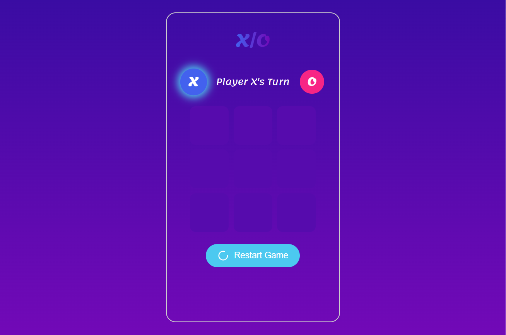
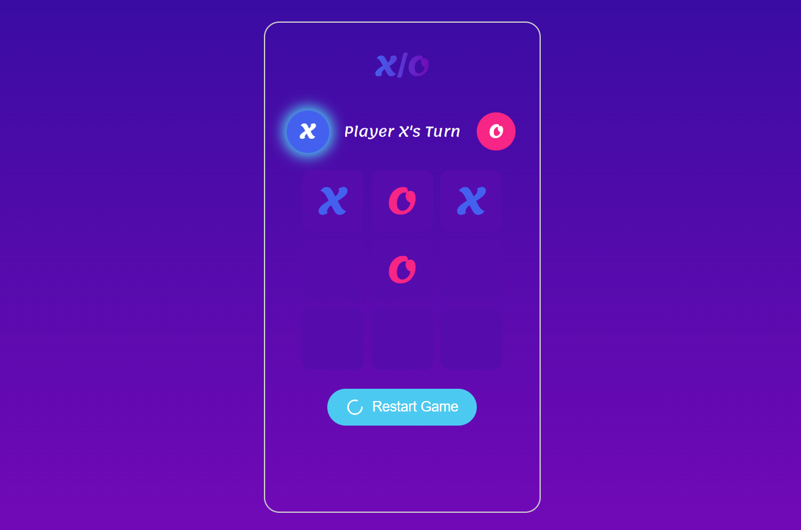
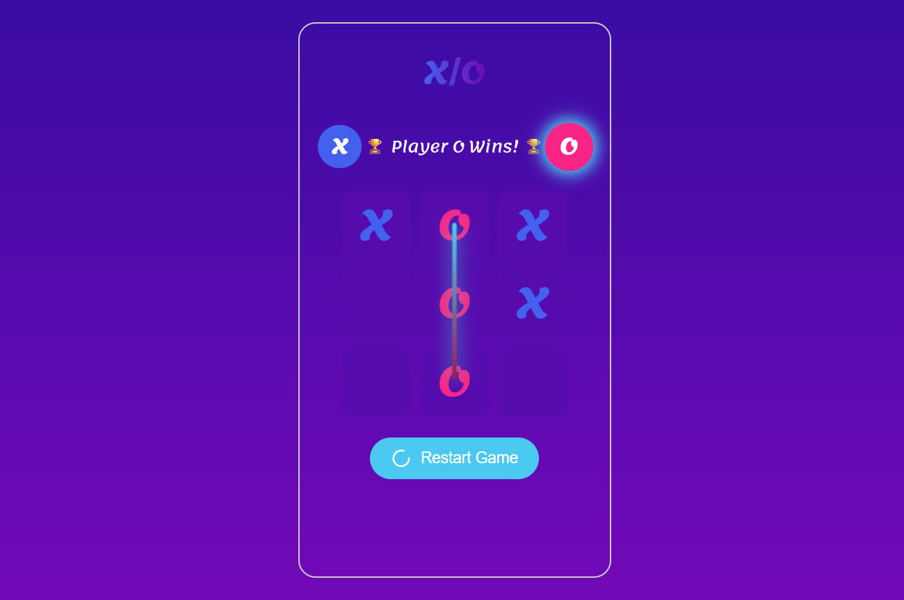

# 🎮 Tic Tac Toe Game (X/O)

A simple implementation of the classic **Tic Tac Toe (X/O)** game built with **HTML, CSS, and JavaScript**.  
It allows two players to play against each other on the same device.

---

## 📸 Screenshots

### Game Interface




*(Make sure screenshots are inside `assets/images/` folder)*

---

## ⚙️ Features
- 🎯 Two-player mode (Player X vs Player O).
- 🔄 Turn indicator showing the current player.
- 🏆 Winner detection with a line across the winning row/column/diagonal.
- 🤝 Draw detection (when the board is full and no winner).
- ♻️ Restart button to play again.

---

## 🚀 Installation & Run

1. Clone the repository:
   ```bash
   git clone https://github.com/naser127a/X-and-O-game.git
